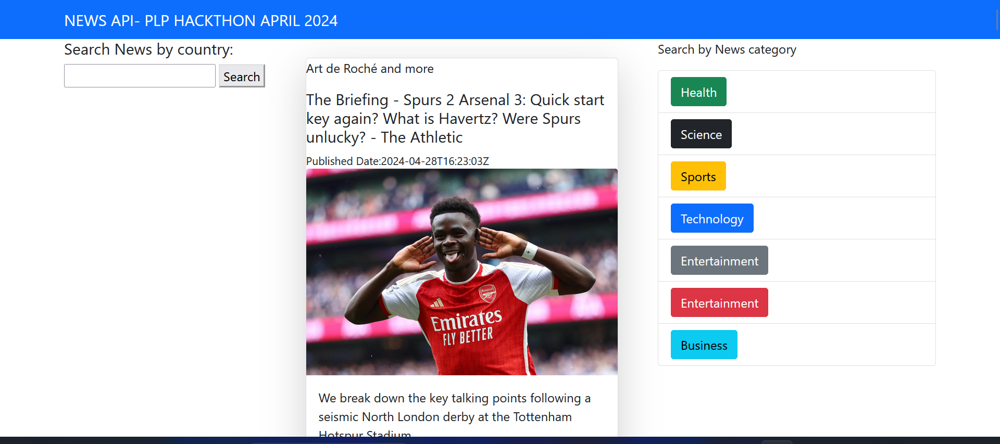

### NEWS API APP WITH DJANGO- PLP HACKTHON APRIL 2024
- Author: Mark Shija
-  Date: April 27, 2024.




### Introduction

- This repository contains all concept we learned about django views and routing (urls) with API requests.

- The project works with NewsAPI to retrive real time news from different sources.

### INSTALLATION

## Section 1: Getting Started
- Clone this repo by running `git clone https://github.com/`in your terminal.
- Navigate to the directory using either bash,cmd, Powershell > cd HACKTHON 2024`.

```cd PLP-PYTHON/HACKTHON_2024```
- make sure that python is installed and added into system enviroment variables in your device
- install Dependencies

```pip install -r requirements.txt```

- Run the Development server 
```python manage.py runserver```
-  Open `http://127.0.0.1:8000` on your  web browser to access the application.

## Section 2: PROJECT STRUCTURE
- The Project has basically one main apps :
- /applicat : This folder holds the main Django App which serves as an interface for users to interact with the data.
- /ProjectF : It's a Django project folder which holds settings for our app.


